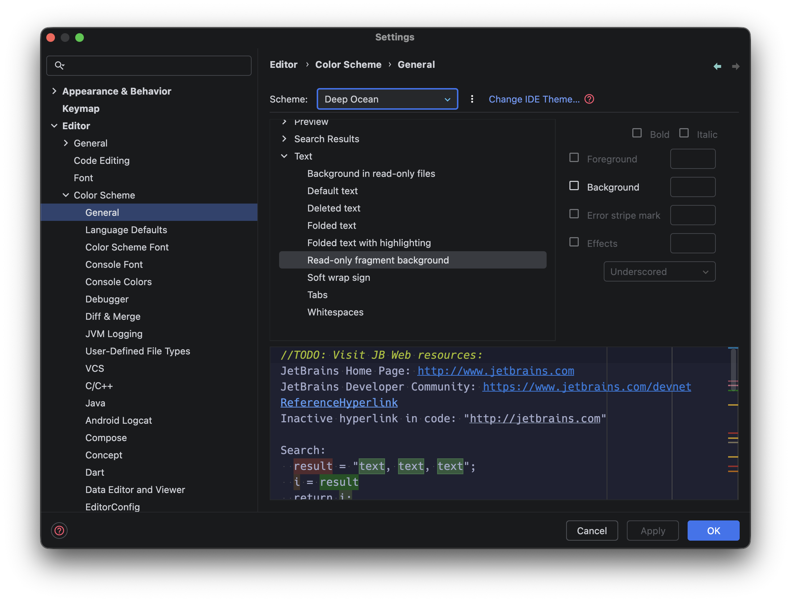
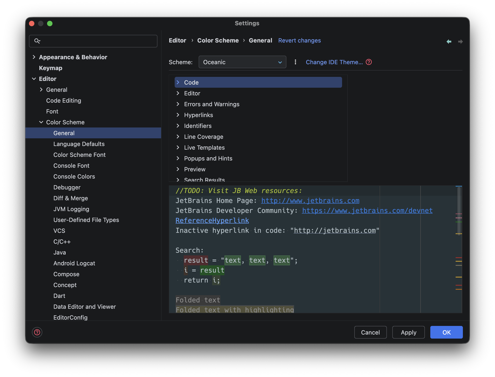

# IntelliJ Color Schemes

A collection of vibrant, oceanic-inspired color schemes for IntelliJ-based IDEs. These themes are designed to provide a premium, modern coding experience with high readability and beautiful contrasts.

> [!IMPORTANT]
> **No plugins required.** These are standard `.icls` files. You can import them directly into your IDE without installing any additional plugins.

## Themes

### 🌊 Deep Ocean
A deep, mysterious navy blue palette with sharp neon accents.

### 🌊 Oceanic
A balanced, professional blue theme inspired by classic oceanic colors.

## Installation

1. Download the `.icls` file of your choice (e.g., `Deep_Ocean.icls` or `Oceanic.icls`).
2. Open your IntelliJ IDE (IntelliJ IDEA, WebStorm, PyCharm, etc.).
3. Go to **File** > **Settings** (on macOS: **IntelliJ IDEA** > **Settings**).
4. Navigate to **Editor** > **Color Scheme**.
5. Click the gear icon (⚙️) next to the "Scheme" dropdown.
6. Select **Import Scheme** > **IntelliJ IDEA color scheme (.icls)**.
7. Choose the downloaded file and click **OK**.
8. Click **Apply** and **OK**.

## License

This project is licensed under the MIT License - see the [LICENSE](LICENSE) file for details.
